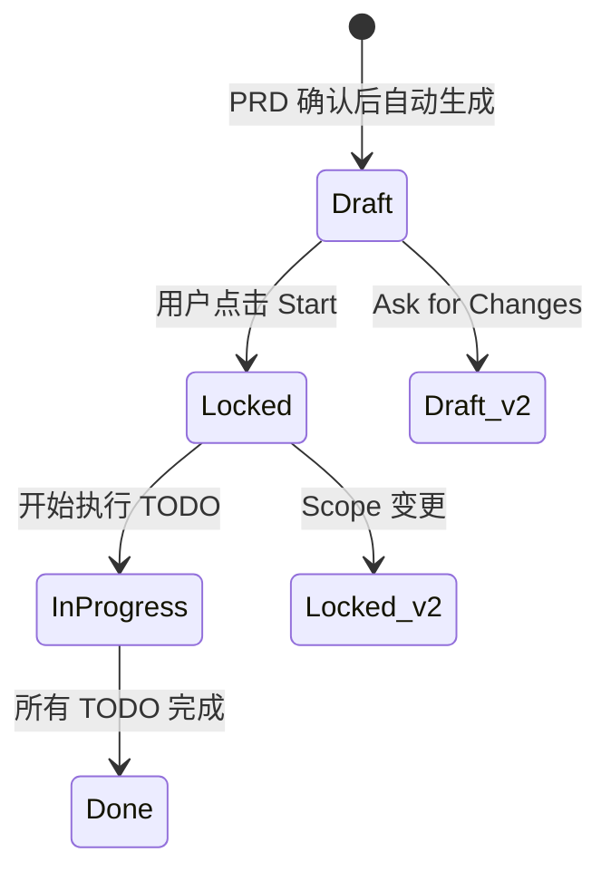
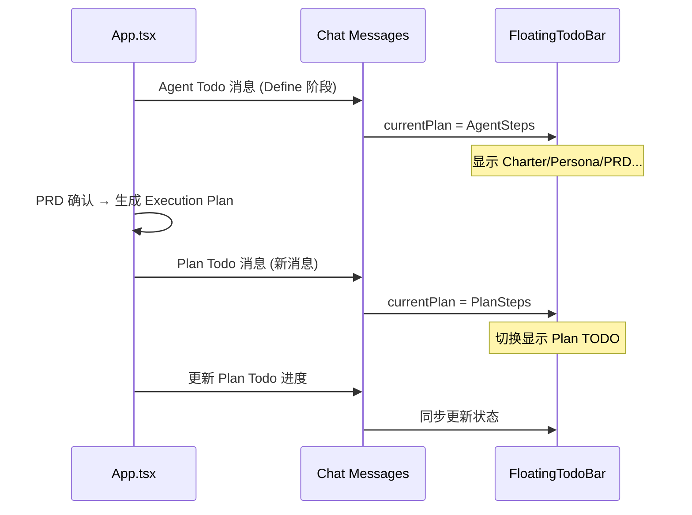

# Execution Plan 系统

## 功能概述

Execution Plan（执行计划）是 Visual Coding Agent 的**长期有效计划文档**，在 Define 产物（Charter/Persona/UserStory/UserFlow/PRD）全部确认后生成，作为后续 Screen 生成与 Build 执行的**单一事实源（Plan-of-record）**。

### 核心定位

| 概念 | 定位 | 生命周期 | 内容 |
|------|------|----------|------|
| **Agent Todo** | 短期工作清单 | 握手/Define 过程 | Charter/Persona/PRD 等过程性步骤 |
| **Execution Plan** | 长期计划文档 | Define 锁定后 → Build 完成 | 完整的目标/范围/输入/输出/TODO/验收标准 |

### 包含关系

```
Execution Plan（长期）
├── Objective（目标）
├── Scope（范围）
├── Inputs（引用 Define 产物）
├── Outputs（交付物）
├── TODO List ──────────────→ 派生为 Chat 的 "Plan TODO 消息"
├── Acceptance Checklist
└── Open Questions / Change Control
```

---

## Execution Plan 模板

```markdown
# Execution Plan — <Project / Feature> — <Iteration ID>

## 0) Plan Status

* Status: Draft / Locked / In Progress / Done
* Owner: <who>
* Date: <YYYY-MM-DD>
* Execution Mode: Design / Build

## 1) Objective (One sentence)

* Objective: <what outcome we want this iteration to achieve>

## 2) Scope

### In Scope

* <bullet list>

### Out of Scope (Hard No)

* <bullet list>

## 3) Inputs (Source of Truth — References only)

> No copy-paste. Every item must be a link/reference to Define artifacts.

* Charter: @Product Charter
* Persona: @User Persona
* Define Lock: <ref> (D1 / D5 / D9)
* PRD sections: @PRD: Create Review, @PRD: Review Room, @PRD: Summary
* User Story / Story Map: @User Story
* User Flow: @User Flow (3屏)
* Prototype references (if any): <ref list>

## 4) Outputs (Deliverables)

* Deliverable 1: <what + format> (e.g., "Prototype v1", "Build demo", "Spec update")
* Deliverable 2: ...
* Where they live: <links/paths/canvas nodes>

## 5) TODO List (Execution Order)

> Each TODO must include: ID, action, refs, done definition.

* [ ] TODO-1: <action>

  * Refs: <ref>
  * Done when: <clear acceptance for this TODO>

* [ ] TODO-2: <action>

  * Refs: <ref>
  * Done when: <clear acceptance>

## 6) Acceptance Checklist (Iteration-level)

* [ ] AC-1: <end-to-end criteria>
* [ ] AC-2: <quality bar>
* [ ] AC-3: <scope sanity: no extras>

## 7) Open Questions / Blockers

> If anything here exists, execution is NOT allowed until resolved (or explicitly deferred).

* Q1: <question>

  * Needed decision by: <date/owner>
  * Options: A / B / C
  * Default if no answer: <explicit fallback or "STOP">

## 8) Change Control (Hard Rule)

* Any scope change must:

  1. update Define (or add a Define TODO)
  2. re-lock Define
  3. generate a new Plan version (v2, v3...)
* Change Log:

  * v1 → v2: <what changed + why + impact>
```

---

## 生命周期

### 1. 生成时机

Execution Plan 在以下条件满足后自动生成：

| 前置条件 | 说明 |
|----------|------|
| PRD 确认 | 所有 PRD 文档的确认卡片状态为 `confirmed` |
| Define 锁定 | User Story + User Flow + PRD 都已锁定 |

### 2. 状态流转



### 3. 版本控制

| 场景 | 行为 |
|------|------|
| 首次生成 | 创建 `Execution Plan — <Project> — v1` 文档节点 |
| Ask for Changes | 保留 v1 节点，创建 `v2` 新节点；v1 标记为历史 |
| Scope 变更 | 同上，生成新版本节点 |

---

## Start 门禁机制

### 门禁控件

Execution Plan 生成后，需要用户显式点击 **Start** 才能进入 Screen 生成/Build 执行阶段。

| 属性 | 值 |
|------|-----|
| 控件类型 | 复用 Confirmation 控件 |
| intent | `start`（区别于普通 `confirm`） |
| 主按钮文案 | **Start** |
| 次要按钮 | Ask for Changes |
| 出现位置 | Chat（ConfirmationCard）+ 画布（NodeConfirmationWidget） |

### 交互规则

| 操作 | 效果 |
|------|------|
| 点击 **Start** | Plan 状态变为 Locked，开始生成 Screen |
| 点击 **Ask for Changes** | 生成 Plan v2 新节点，重新显示 Start 门禁 |

### 视觉设计

- 主按钮样式与 Confirm 一致（`bg-moxt-brand-7`）
- 文案为 **Start**
- 状态指示器：绿色脉冲圆点（表示"准备就绪，等待启动"）

---

## Todo 同步机制

### 两层 Todo 体系

| 层级 | 来源 | 显示位置 | 更新时机 |
|------|------|----------|----------|
| **Agent Todo** | `executeWorkflow` 中的 PlanStep[] | FloatingTodoBar（Define 阶段） | Define 过程实时更新 |
| **Plan Todo** | Execution Plan 文档的 §5 TODO List | FloatingTodoBar（Execution 阶段） | Start 后派生新消息 |

### 同步流程



### 实现要点

1. **Agent Todo 保留**：Define 阶段的 todo 消息保留在历史中，不删除
2. **Plan Todo 新增**：Start 后创建新的 Chat 消息（`type='ai'`，带 `plan` 字段）
3. **FloatingTodoBar 跟随**：`setCurrentPlan()` 切换到最新的 Plan Todo
4. **进度更新**：后续用 Plan Todo 的 messageId 调用 `updatePlanStatus()`

---

## 与现有系统的集成

### 消息系统

在 `04-message-system.md` 中扩展：

```typescript
// ConfirmationData 扩展
export interface ConfirmationData {
  // ... 现有字段
  intent?: 'confirm' | 'start';        // 门禁类型
  primaryActionLabel?: string;          // 主按钮自定义文案
}
```

### 工作流引擎

在 `07-workflow-engine.md` 的 PRD 确认后插入：

```
PRD 确认 → ✨ Execution Plan 生成 → Start 门禁 → Screen 生成
```

### 画布系统

- Execution Plan 作为 **Document 节点** 出现在画布
- 节点标题格式：`Execution Plan — <Project> — v1`
- 所属 Section：`SECTION_IDS.DEFINE`

---

## Mock 数据示例

```typescript
const MOCK_EXECUTION_PLAN = {
  content: `# Execution Plan — Video Review — v1

## 0) Plan Status

* Status: Draft
* Owner: Paraflow Agent
* Date: 2024-01-15
* Execution Mode: Design

## 1) Objective (One sentence)

* Objective: 生成一个 3 屏视频审片 MVP 原型，验证"创建 → 评论 → 汇总"的核心闭环

## 2) Scope

### In Scope

* Screen A: Create review（输入项目名+视频链接）
* Screen B: Review room（播放器+时间轴评论）
* Screen C: Summary（评论汇总列表）

### Out of Scope (Hard No)

* 用户登录/注册
* 多文件上传
* 团队权限管理
* Reviewer 名字

## 3) Inputs (Source of Truth — References only)

* Charter: @Product Charter
* Persona: @User Persona
* PRD sections: @PRD: Create Review, @PRD: Review Room, @PRD: Summary
* User Story: @User Story
* User Flow: @User Flow (3屏)

## 4) Outputs (Deliverables)

* Deliverable 1: 3 屏可点击原型（Screen A/B/C）
* Deliverable 2: 页面间导航 Edges
* Where they live: Canvas Prototype Section

## 5) TODO List (Execution Order)

* [ ] TODO-1: 生成 Screen A: Create review
  * Refs: @PRD: Create Review
  * Done when: 页面可点击，包含输入框和按钮

* [ ] TODO-2: 生成 Screen B: Review room
  * Refs: @PRD: Review Room
  * Done when: 播放器+评论列表+添加评论功能

* [ ] TODO-3: 生成 Screen C: Summary
  * Refs: @PRD: Summary
  * Done when: 评论汇总列表+返回按钮

* [ ] TODO-4: 创建页面间导航 Edges
  * Refs: @User Flow (3屏)
  * Done when: A→B→C 导航可点击

## 6) Acceptance Checklist (Iteration-level)

* [ ] AC-1: 3 屏可以完整走通 Happy Path
* [ ] AC-2: 每个屏幕的 UI 符合 PRD 描述
* [ ] AC-3: 没有超出 Scope 的额外功能

## 7) Open Questions / Blockers

（无）

## 8) Change Control (Hard Rule)

* Any scope change must:
  1. update Define (or add a Define TODO)
  2. re-lock Define
  3. generate a new Plan version (v2, v3...)
* Change Log:
  * (Initial version)
`
};
```

---

## 验收标准

- [ ] PRD 确认后自动生成 Execution Plan 文档节点
- [ ] Plan 节点标题格式正确（含版本号）
- [ ] Chat 出现对应文件卡片（可定位/可编辑）
- [ ] Start 门禁控件正确显示（Chat + 画布）
- [ ] 点击 Start 后：
  - [ ] Plan 状态变为 Locked
  - [ ] Chat 新增 Plan Todo 消息
  - [ ] FloatingTodoBar 切换到 Plan Todo
  - [ ] 开始生成 Screen
- [ ] Ask for Changes 后：
  - [ ] 生成 v2 新节点
  - [ ] v1 保留可回溯
  - [ ] 重新显示 Start 门禁
- [ ] Screen 生成进度与 Plan Todo 同步更新

---

## 未来优化

- [ ] Plan 文档的实时编辑与版本 diff
- [ ] 支持手动添加/修改 TODO
- [ ] TODO 完成后自动打勾并更新 Plan 文档
- [ ] Plan 模板库（不同类型项目的预设模板）
- [ ] 与外部项目管理工具集成（Jira/Linear）

