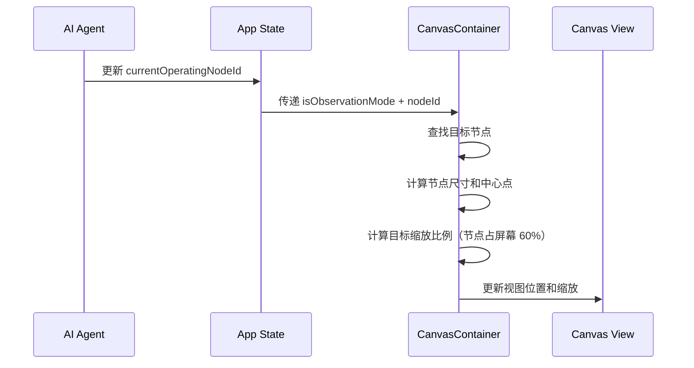

# Chat 系统与观察模式产品需求文档

## 1. 产品概述

### 1.1 产品定位

Chat 是 Visual Coding Agent 的核心交互入口。用户通过自然语言对话与 AI 协作，驱动产品规划工作的自动化执行。

### 1.2 核心价值

| 价值点 | 描述 |
|--------|------|
| **对话驱动** | 用户用自然语言描述需求，无需学习复杂操作 |
| **过程透明** | 实时展示 AI 思考过程、工具调用、任务进度 |
| **上下文关联** | 通过 @ Mention 关联画布上的节点，精准沟通 |
| **渐进式交互** | 通过问答收集关键决策，确保产出符合预期 |
| **实时观察** | 观察模式让用户实时跟随 AI 在画布上的工作过程 |

---

## 2. 用户场景

### 2.1 典型使用流程：从零开始创建产品规划

以「帮我做一个外卖 App」为例，展示用户从发起需求到完成规划的完整流程。

---

**阶段一：需求输入**

用户在输入框描述产品想法，如「帮我做一个外卖 App，支持用户下单、骑手配送、商家管理」。发送后，消息以气泡形式显示在对话区右侧。

---

**阶段二：需求澄清**

AI 识别到用户的核心需求是「外卖 App」，但具体的业务模式和产品侧重点尚不明确。为了生成更精准的方案，AI 结合行业知识生成**场景化决策问题**：

- **业务模式**（聚合平台-如美团 / 自营品牌-如瑞幸 / 垂直服务-如校园送）
- **核心体验**（效率优先-快速下单 / 探索发现-浏览种草 / 社交驱动-拼单分享）
- **视觉风格**（活力橙红-食欲感 / 极简黑白-高端感 / 清新绿色-健康感）
- **功能范围**（仅用户端 / 用户端+商家端 / 全套-含骑手端）

用户逐题选择答案，每选一题卡片自动滚动到下一题。用户可随时点击「跳过」跳过当前问题，或点击「继续」结束问答。

问答结束后，卡片自动折叠为答案摘要。

---

**阶段三：计划确认**

AI 根据需求和用户回答，生成**执行计划**。计划以任务列表形式展示，例如：

1. 创建产品需求文档
2. 设计用户流程图
3. 创建交互原型（5 个核心页面）
4. 编写后端架构规划
5. 设计数据库表结构
6. 配置第三方集成

计划底部显示「开始执行」按钮。用户点击后，按钮消失，AI 开始自动执行任务。

---

**阶段四：任务执行**

点击「开始执行」后，输入框上方出现**悬浮进度条**，显示当前任务和完成比例（如 1/6）。

AI 依次执行每个任务。执行过程中，Chat 面板会显示不同类型的消息：

- **思考消息**：AI 开始处理复杂任务时，显示「Thinking...」动画，让用户知道系统正在工作
- **工具调用消息**：AI 读取参考资料、搜索模板时，以简化文本显示（如「Read product-template.md」）
- **文件操作消息**：AI 在画布上创建节点时，显示卡片（如「📄 Product Requirements Doc - Created」），附带定位按钮
- **确认卡片消息**：关键产物生成后，AI 暂停执行，等待用户确认或提出修改意见

每完成一个任务，进度条自动更新，当前任务标记为完成，开始执行下一个任务。

---

**阶段五：结果查看**

全部任务完成后，进度条显示「Execution complete」。

用户可以：
- 点击文件操作消息中的**定位按钮**，画布自动平移并聚焦到对应节点
- 继续在输入框中与 AI 对话，提出修改意见或新需求
- 开启**观察模式**，回顾 AI 的工作轨迹

---

### 2.2 消息类型场景速查

| 消息类型 | 使用场景 | 用户可操作 |
|----------|----------|------------|
| 用户消息 | 发起需求、追问、反馈修改意见 | 输入文字、@ 引用节点、添加图片 |
| 问题卡片 | AI 需要澄清关键决策时出现 | 选择选项、翻页、跳过、继续 |
| 执行计划 | 展示任务列表 + 悬浮进度条 | 开始执行、展开/收起进度 |
| 思考消息 | AI 处理复杂任务时展示推理过程 | 完成后可展开/折叠查看内容 |
| 操作反馈 | AI 执行操作后反馈（读取、创建节点等） | 点击定位按钮跳转画布（如适用） |
| 确认卡片 | 关键产物生成后等待用户确认 | 确认继续、请求修改、定位、编辑 |

---

## 3. 消息类型定义

Chat 系统支持 6 种消息类型，每种类型有独立的展示规则和交互逻辑。

### 3.1 用户消息 / AI 消息

**场景**：用户发起需求、AI 回复分析结果

**用途**：基础对话，用户输入和 AI 文本回复

| 属性 | 用户消息 | AI 消息 |
|------|----------|---------|
| 对齐方式 | 右对齐 | 左对齐 |
| 背景样式 | 灰色气泡 | 无背景 |
| 宽度限制 | 最大 80% | 全宽 |
| 格式支持 | 纯文本 + 图片 | Markdown 全格式 |

**AI 消息 Markdown 支持**：
- 标题（H1-H6）
- 无序/有序/任务列表
- 引用块、代码块
- 粗体、斜体、行内代码、链接

---

### 3.2 问题卡片消息

**场景**：AI 需要收集用户的产品决策（如项目类型、技术复杂度）

**用途**：通过选择题收集关键决策，确保产出符合用户预期

**卡片结构**：

卡片分为三个区域：
- **头部**：左侧显示问题图标和「Questions」标题
- **内容区**：显示当前问题序号和文本，下方列出 A/B/C/D... 选项（支持多选），自动附加 Other 选项
- **底部**：左侧显示导航按钮，中间显示分页圆点，右侧显示前进按钮

**选项特性**：

| 特性 | 说明 |
|------|------|
| 多选支持 | 用户可同时选择多个选项，点击已选选项可取消 |
| Other 选项 | 每道题自动附加 Other 选项，供用户自定义答案 |
| 自定义输入 | 选中 Other 后，下方展开文本输入框 |
| 选中状态 | 已选选项显示灰色高亮背景（`bg-moxt-fill-2`） |

**导航按钮**：

| 按钮位置 | 第一题 | 中间题 | 最后一题 |
|----------|--------|--------|----------|
| 左侧 | Skip all | Back | Back |
| 右侧 | Next | Next | Submit |

**分页圆点**：
- 当前题目显示为长条形（`w-4 h-1.5`）
- 其他题目显示为小圆点（`w-1.5 h-1.5`）
- 点击圆点可直接跳转到对应题目

**交互规则**：

| 操作 | 作用 |
|------|------|
| 点击选项 | 切换选中状态（支持多选） |
| 选中 Other | 展开自定义输入框 |
| Skip all | 跳过所有问题，直接结束问答 |
| Back | 返回上一题 |
| Next | 进入下一题 |
| Submit | 提交所有答案，触发后续流程 |
| 点击圆点 | 跳转到指定题目 |

**折叠状态**：
- 问答完成后自动折叠为摘要
- 多选答案以逗号分隔显示，例如：「Question 1/4: SaaS, B2B」
- Other 选项显示用户输入的自定义文本

---

### 3.3 执行计划消息

**场景**：AI 分析完需求后，展示工作计划供用户确认

**用途**：让用户了解即将执行的任务，并主动触发执行

**卡片结构**：

卡片分为三个区域：
- **头部**：显示「EXECUTION PLAN」标题
- **任务列表**：纵向排列所有任务，每个任务前显示状态图标
- **底部**：首次显示时包含「开始执行」按钮，点击后按钮消失

**任务状态**：

| 状态 | 图标 | 说明 |
|------|------|------|
| pending | ○ | 等待执行 |
| loading | ⏳ | 正在执行（带旋转动画） |
| done | ✓ | 已完成（绿色） |

**启动与执行**：

用户点击「开始执行」按钮后：
1. 按钮立即消失（防止重复触发）
2. 输入框上方出现悬浮进度条
3. 当前任务状态变为 loading
4. AI 执行任务，发送操作反馈消息
5. 任务完成后状态变为 done，自动进入下一个任务
6. 重复直到所有任务完成

**悬浮进度条**：

执行计划启动后，输入框上方出现悬浮进度条，用于追踪整体进度。

收起状态（单行布局）：
- 当前任务的状态图标
- 当前任务名称
- 状态文字（Processing... 或 Execution complete）
- 进度比例（如 2/6）
- 展开/收起按钮

展开状态：
- 点击后在下方显示完整任务列表
- 已完成任务显示勾选图标，文字带删除线
- 执行中任务高亮显示
- 待执行任务显示空心圆图标

完成动画：
- 单个任务完成时：短暂高亮 + 缩放效果
- 全部完成时：显示「Execution complete」

---

### 3.4 思考消息

**场景**：AI 开始处理任务时，展示推理过程

**用途**：增强透明度和可解释性，让用户知道 AI 在"思考"

**两种状态**：

| 状态 | 展示形式 | 说明 |
|------|----------|------|
| 思考中 | 🧠 Thinking... | 跳动动画，表示正在处理 |
| 完成 | 🧠 Thought process ▶ | 可展开查看思考内容 |

**交互规则**：
- 思考完成后，内容默认折叠
- 点击可展开/收起查看详细推理过程

---

### 3.5 操作反馈消息

**场景**：AI 执行各类操作时，向用户反馈执行状态

**用途**：展示 AI 正在执行的具体操作，增强透明度和信任感

操作反馈消息按重要程度分为两种展示形式：

---

#### 3.5.1 轻量操作（简化文本）

适用于高频、不影响结果的辅助操作，以简化文本形式展示，不打断用户阅读。

| 操作类型 | 展示文案 | 对应命令 | 示例 |
|----------|----------|----------|------|
| 搜索代码 | Search | grep | Search user-stories |
| 读取文件 | Read | read, cat, head, tail | Read product-template.md |
| 浏览目录 | Browsing files | ls, list_dir | Browsing files in /src |

---

#### 3.5.2 重要操作（完整卡片）

适用于会产生实际结果的操作，以卡片形式展示，包含状态指示和交互按钮。

**卡片结构**（单行紧凑布局）：
- **左侧**：操作类型图标
- **中间**：操作名称 + 状态文字（Creating.../Created/Failed）
- **右侧**：操作成功后显示定位按钮（如适用）

**操作类型**：

| 操作类型 | 图标 | 说明 | 定位按钮 |
|----------|------|------|----------|
| 创建文档节点 | 📄 | 在画布创建 Document | ✓ |
| 创建白板节点 | 🎨 | 在画布创建 Whiteboard | ✓ |
| 创建原型节点 | 📱 | 在画布创建 Screen | ✓ |
| 创建数据表节点 | 📊 | 在画布创建 Table | ✓ |
| 创建集成节点 | 🔌 | 在画布创建 Integration | ✓ |
| 移动节点 | 📦 | 移动或重命名画布节点 | ✓ |
| 创建分区 | 📁 | 在画布创建 Section | ✓ |
| 删除节点 | 🗑️ | 删除画布节点 | - |
| 编辑文件 | 📝 | 编辑代码/配置文件 | - |
| 创建文件 | 📝 | 创建代码/配置文件 | - |

**状态指示**：
- 执行中：旋转加载图标
- 成功：绿色勾选图标
- 失败：红色错误图标

**交互规则**：
- 画布节点创建成功后显示「定位」按钮
- 点击定位按钮，画布自动平移并聚焦到该节点

---

### 3.6 确认卡片消息

**场景**：关键产物（如 Story Map、User Flow、PRD）生成后，需要用户确认才能继续

**用途**：在关键节点暂停执行，确保产出符合用户预期，支持用户提出修改意见

**卡片结构**：

卡片分为三个区域：
- **头部**：左侧显示状态图标和卡片标题（如「S1 原型确认」），右侧显示状态标签
- **内容区**：
  - 说明文案，告知用户需要确认什么
  - 待确认文件列表，每个文件显示类型图标、标题、编辑按钮和定位按钮
- **操作区**：「Ask for Changes」和「Approve & Continue」按钮

**三种状态**：

| 状态 | 头部样式 | 状态标签 | 操作区 |
|------|----------|----------|--------|
| pending | 绿色脉冲圆点 | - | 显示操作按钮 |
| confirmed | 绿色勾选图标 + 浅绿背景 | Confirmed | 隐藏操作区 |
| revision_requested | 灰色历史图标 | Asked for Changes | 显示用户的修改意见 |

**交互规则**：

| 操作 | 作用 |
|------|------|
| Approve & Continue | 标记为已确认，继续执行下一阶段 |
| Ask for Changes | 弹出输入框，填写修改意见后提交 |
| 编辑按钮 | 打开对应节点的编辑器 |
| 定位按钮 | 画布自动平移并聚焦到该节点 |

**修改意见输入**：
- 点击「Ask for Changes」后，底部展开输入区域
- 支持多行文本输入
- 按 Enter 提交，按 Esc 取消
- 提交后卡片状态变为 revision_requested，显示用户的修改意见

---

## 4. @ Mention 功能

用户可在输入框中通过 @ 引用画布上的节点或内部元素，实现精准的上下文关联。

### 4.1 触发方式

| 方式 | 操作 | 说明 |
|------|------|------|
| 文本触发 | 输入 `@` | 必须在开头或空格后 |
| 画布选择 | 点击「从画布选择」 | 进入选择模式 |

### 4.2 Mention 面板

输入 `@` 后弹出选择面板，内容排序：
1. 「从画布选择」选项（置顶，有区分度的背景）
2. Section（分区）
3. 各类节点（按类型分组）

键盘操作：
- ↑/↓：上下选择
- Enter：确认选择
- Esc：关闭面板
- 继续输入：实时过滤

### 4.3 画布选择模式

点击「从画布选择」后进入选择模式，可选中画布上的节点或节点内部元素（如 Screen 中的 div）。

视觉反馈：
- 光标变为 pointer
- 悬停元素显示蓝色高亮框

退出方式：
- 点击目标元素（完成选择）
- 按 Esc 键（取消）
- 点击空白区域（取消）

### 4.4 引用效果

**输入框**：插入 `@节点名称` 或 `@节点名称-元素标识`

**画布**：
- 被引用节点/元素显示蓝色边框
- 左上方显示蓝色标签 `@名称 ×`
- 点击 × 可删除引用

**消息历史**：
- 按节点类型显示蓝色高亮

---

## 5. 输入增强功能

### 5.1 图片附件

**场景**：用户需要提供视觉参考（如竞品截图、手绘草图、设计稿）

**用途**：让 AI 理解用户的视觉意图，生成更贴合预期的产物

**上传方式**：

| 方式 | 操作 |
|------|------|
| 点击按钮 | 点击输入框左侧的图片图标 |
| 粘贴 | 在输入框内 Ctrl/Cmd + V 粘贴剪贴板图片 |
| 拖拽 | 将图片文件拖拽到输入框区域 |

**预览与管理**：
- 上传后在输入框上方显示图片缩略图
- 每张图片右上角显示删除按钮（×）
- 支持同时上传多张图片
- 图片随消息一起发送

**视觉设计**：
- 缩略图尺寸：固定高度，宽度自适应
- 背景：浅灰色圆角容器
- 删除按钮：悬停时显示

---

### 5.2 会话历史

**场景**：用户需要切换到之前的对话，或查找历史记录

**用途**：管理多个对话会话，保持工作连续性

**入口**：
- 点击 Chat 面板顶部的历史图标打开历史面板

**历史面板结构**：

```
┌─────────────────────────────────┐
│ 🔍 [搜索框]                      │
├─────────────────────────────────┤
│ Today                           │
│   外卖 App 规划         ✏️ 🗑️   │
│   电商小程序           ✏️ 🗑️   │
├─────────────────────────────────┤
│ Yesterday                       │
│   健身追踪 App         ✏️ 🗑️   │
├─────────────────────────────────┤
│ Last 7 Days                     │
│   社交平台原型         ✏️ 🗑️   │
└─────────────────────────────────┘
```

**功能列表**：

| 功能 | 操作 |
|------|------|
| 搜索 | 在搜索框输入关键词，实时过滤历史记录 |
| 切换会话 | 点击历史记录项，加载对应对话 |
| 编辑标题 | 点击编辑图标，修改会话标题 |
| 删除会话 | 点击删除图标，确认后删除 |
| 新建会话 | 点击顶部「新建」按钮，创建空白会话 |

**分组规则**：
- Today：今天的对话
- Yesterday：昨天的对话
- Last 7 Days：最近 7 天的对话
- Earlier：更早的对话

---

### 5.3 侧边栏交互

**侧边栏布局**：

Chat 侧边栏位于界面左侧，包含以下区域（从上到下）：
1. 头部：Logo、新建按钮、历史按钮、折叠按钮
2. 消息区：对话消息流
3. 输入区：悬浮进度条、问题卡片（如有）、输入框

**宽度调整**：

| 属性 | 值 |
|------|-----|
| 默认宽度 | 420px |
| 最小宽度 | 320px |
| 最大宽度 | 600px |

操作：
- 鼠标悬停在右边缘，光标变为 `col-resize`
- 拖拽调整宽度，实时响应
- 松开鼠标，宽度固定

**折叠/展开**：

| 状态 | 侧边栏显示 | 画布显示 |
|------|------------|----------|
| 展开 | 完整宽度 | 占据剩余空间 |
| 折叠 | 仅显示折叠按钮 | 占据全屏 |

操作：
- 点击头部的折叠图标
- 快捷键：`Cmd/Ctrl + \`

---

## 6. 观察模式

### 6.1 功能概述

**定义**：观察模式是一种画布跟随机制，当 AI Agent 在画布上执行操作时，视口自动平移和缩放，让当前操作的节点始终保持在屏幕中央。

**核心价值**：

| 价值点 | 描述 |
|--------|------|
| **实时感知** | 用户无需手动操作即可观看 AI 的工作过程 |
| **专注体验** | 自动聚焦当前节点，无需分心寻找 |
| **过程透明** | 增强用户对 AI 工作流程的理解和信任 |

---

### 6.2 状态面板

状态面板位于画布顶部居中位置，以胶囊形态展示当前 Agent 状态。

**三种状态**：

| 状态 | 触发条件 | UI 样式 | 操作按钮 |
|------|----------|---------|----------|
| 跟随中 | `isObservationMode = true` | 绿色实心背景 | Stop Following |
| 工作中 | `isRunning = true` 且非跟随 | 白色背景 + 绿色边框 | Follow |
| 暂停 | `isRunning = false` | 白色背景 + 灰色边框 | Resume |

**视觉设计**：

```
┌─────────────────────────────────────┐
│ ● Following Paraflow │ Stop Following │  ← 跟随中状态
└─────────────────────────────────────┘

┌─────────────────────────────────────┐
│   Paraflow is working  │   Follow   │  ← 工作中状态
└─────────────────────────────────────┘

┌─────────────────────────────────────┐
│ ○ Paused              │   Resume   │  ← 暂停状态
└─────────────────────────────────────┘
```

**样式规范**：
- 圆角：`rounded-md`
- 阴影：`shadow-[0_8px_30px_rgb(0,0,0,0.12)]`
- 高度：36px
- 字号：12px
- 按钮分隔线：1px 竖线

---

### 6.3 画布跟随机制

**触发条件**：
- `isObservationMode` 为 true
- `currentOperatingNodeId` 指向有效节点

**跟随逻辑**：



**计算规则**：

| 参数 | 计算方式 |
|------|----------|
| 目标缩放 | `min(containerW * 0.6 / nodeW, containerH * 0.6 / nodeH)` |
| 缩放限制 | 限制在 `MIN_ZOOM` 和 `MAX_ZOOM` 范围内 |
| 目标位置 X | `(containerW / 2) - (nodeCenterX * scale)` |
| 目标位置 Y | `(containerH / 2) - (nodeCenterY * scale)` |

**防抖动机制**：
- 仅当位置变化 > 1px 或缩放变化 > 0.001 时才更新视图
- 避免高频更新导致的画布抖动

---

### 6.4 用户交互规则

**开启跟随**：
- 点击状态面板的「Follow」按钮
- 画布立即平移到当前操作节点

**关闭跟随**：
- 点击状态面板的「Stop Following」按钮
- 画布保持在当前位置，不再自动跟随

**跟随模式下的用户操作**：

| 用户操作 | 系统响应 |
|----------|----------|
| 拖拽画布 | 允许，但下次节点切换时会被拉回 |
| 缩放画布 | 允许，但下次节点切换时会被重置 |
| 点击节点 | 允许，不影响跟随状态 |
| 编辑节点 | 允许，不影响跟随状态 |

**暂停与恢复**：
- Agent 完成所有任务后自动暂停
- 点击「Resume」可恢复执行（如有待执行任务）

---

### 6.5 视觉反馈

**当前操作节点高亮**：

当 Agent 正在操作某个节点时，该节点通过 `currentOperatingNodeId` 标识：
- 节点边框变为主题色
- 可添加脉冲动画效果

**刚创建节点动画**：

通过 `justCreatedNodeIds` 数组标识刚创建的节点：
- 入场动画：缩放 + 渐显
- 短暂高亮后恢复正常样式
- 动画时长：约 500ms

**节点状态指示**：

| 节点状态 | 视觉表现 |
|----------|----------|
| 正在操作 | 主题色边框 + 脉冲动画 |
| 刚创建 | 放大动画 + 高亮边框 |
| 加载中 | 节点内显示加载指示器 |
| 已完成 | 正常显示 |
| 错误 | 红色边框 + 错误图标 |

---

## 附录

### A. 类型定义

```typescript
// 消息类型
export type MessageType = 'user' | 'ai' | 'tool_call' | 'question' | 'file_operation' | 'thinking' | 'confirmation';

// 问题选项
export interface QuestionOption {
  id: string;
  label: string;
  description?: string;
  isOther?: boolean;        // 是否为 Other 选项（支持自定义输入）
}

// 问题数据（支持多题多选）
export interface QuestionData {
  questionId: string;
  questionText: string;
  options: QuestionOption[];
  currentPage: number;
  totalPages: number;
  selectedOptionId?: string;
  answered?: boolean;
  allQuestions?: QuestionData[];  // 多题模式：传递所有问题
  currentIndex?: number;
}

// 确认卡片数据
export interface ConfirmationData {
  title: string;                    // 卡片标题
  description: string;              // 说明文案
  items: ConfirmationItem[];        // 待确认的文件/节点列表
  status: 'pending' | 'confirmed' | 'revision_requested';
  revisionNote?: string;            // 用户的修改意见
}

export interface ConfirmationItem {
  nodeId: string;           // 节点 ID
  nodeType: NodeType;       // 节点类型
  title: string;            // 文件/节点标题
  preview?: string;         // 可选：简短预览文本
}

// 执行计划步骤
export interface PlanStep {
  id: string;
  label: string;
  status: 'pending' | 'loading' | 'done';
}

// 画布视图
export interface CanvasView {
  x: number;
  y: number;
  scale: number;
}
```

### B. 组件映射

| 功能 | 核心组件 |
|------|----------|
| Chat 侧边栏 | `components/Chat/ChatSidebar.tsx` |
| 确认卡片 | `components/Chat/ConfirmationCard.tsx` |
| 问题卡片 | `components/Chat/QuestionCard.tsx` |
| 悬浮进度条 | `components/Chat/FloatingTodoBar.tsx` |
| 工具调用消息 | `components/Chat/ToolCallMessage.tsx` |
| 思考消息 | `components/Chat/ThinkingMessage.tsx` |
| 文件操作消息 | `components/Chat/FileOperationCard.tsx` |
| 状态面板 | `components/Canvas/AgentStatusPanel.tsx` |
| 画布容器 | `components/Canvas/CanvasContainer.tsx` |

